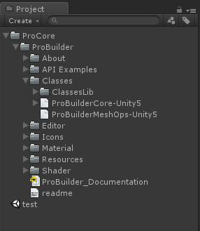

# FAQ

<a name="convert-to-package-manager"></a>
## Upgrading to Probuilder Package v3.0

In most cases, the process to upgrade a Unity project using ProBuilder 2.9.8 or lower to ProBuilder 3.0.0 or higher is simply to import the latest version. However, if that fails you may manually invoke the upgrade utility.

`Tools/ProBuilder/Repair/Convert to Package Manager`

To force the **Convert to Package Manager** utility to run, context click in the window and select "Find and Replace Deprecated File Ids."

## Source Code

Currently source code access is not available. We're working on getting it published soon.

## API

The ProBuilder API is currently considered to be in **beta**. It **will** change before the final release.

## Pink Shaders

If you are upgrading a project from the Asset Store package make sure to run the [Convert to Package Manager](#convert-to-package-manager) utility.

If you're using the new Standard Rendering Pipeline you may have issues compiling the ProBuilder default shader. As a workaround, you can set the default material for ProBuilder in:

`Edit > Preferences > ProBuilder`

Under "Default Material."


## Error building Player (Windows Store, iOS, Android, WebGL)

Usually seen with console errors:

- `Error building Player: UnityException: Failed to run serialization weaver with command`
- `Reference Rewriter found some errors with command`

To get things compiling again, you need to mark the ProBuilder Mesh Operations DLLs as Editor only.


The caveat is that this means you won't be able to access any of the ProBuilder mesh operations API at runtime.

If this step does not address the build issues, it may be necessary to strip ProBuilder scripts entirely before compile.  Fortunetely this is also trivial:

### Steps to Strip ProBuilder Scripts at Build Time

1. First make sure that `Strip PB Scripts on Build` is checked in the Preferences/ProBuilder panel.

	

1. Next, locate `ProBuilderCore-Unity5.dll` and `ProBuilderMeshOps-Unity5.dll` in your project.

	

1. With both `ProBuilderCore-Unity5` and `ProBuilderMeshOps-Unity5` selected, in the Inspector window un-check "Any Platform."  Then toggle both "Editor" and "Standalone."

	


If you're using ProBuilder 2.5 or lower, some errors will appear when scripts reload.  Open the following files (in ProBuilder/API Examples):

- IcoBumpin.cs
- HueCube.cs
- RuntimeEdit.cs

In each of these files, place this line at the very beginning:

	#if UNITY_EDITOR || UNITY_STANDALONE

and this line at the very end:

	#endif

For example, here's what `RuntimeEdit.cs` looks like:

	#if UNITY_STANDALONE || UNITY_EDITOR
	using UnityEngine;
	using System.Collections;
	using ProBuilder2.Common;

	namespace ProBuilder2.Examples
	{

		/**
		 *	\brief This class allows the user to select a single face at a time and move it forwards or backwards.
		 *	More advanced usage of the ProBuilder API should make use of the pb_Object->SelectedFaces list to keep
		 *	track of the selected faces.
		 */
		public class RuntimeEdit : MonoBehaviour
		{
			// ... etc
		}
	}
	#endif

Now compile your project and run!

## Missing Icons

If you upgraded ProBuilder and are now missing icons in the toolbar, first try restarting Unity.

If that does not work,

1. Delete this folder: `ProCore/ProBuilder/Resources/GUI`
2. Re-import ProBuilder from Asset Store / ProCore Downloads

## Spotty Textures on Lightmapped Objects


The object does not have a UV2 channel built.

- Select the affected objects
- Click `Generate UV2` in the ProBuilder Toolbar

## `FbxPrefab` could not be found. Are you missing an assembly reference?

```
Assets/ProCore/ProBuilder/Editor/Addons/pb_Fbx.cs(62,35): error CS0246: The type or namespace name `FbxPrefab' could not be found. Are you missing an assembly reference?
```

This error may occur if you have imported the **FbxExporters** Unity package, then later removed it. To fix this error, you can either:

- Re-import the **FbxExporter** package
- Open `Edit > Project Settings > Player` and in the **Scripting Define Symbols** field delete `PROBUILDER_FBX_ENABLED`.
