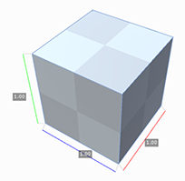

# Menu Actions
## About

Provides info about the currently installed version of ProBuilder.

## Documentation

Opens the latest Documentation online.

## Check for Updates

Check for any available ProBuilder updates.

## Dimensions Overlay

Show or hide the Dimensions Overlay, which works on all mesh objects (not just ProBuilder)

## Actions

> *Tools > ProBuilder > Actions*

### Generate UV2

- **Generate UV2 - Selection:** If you have toggled off the automatic generation of UV2 channels in Preferences, you can use this item to build UV2 (lightmap) channels for the current selection.

- **Generate UV2 - Scene:** This generates UV2 (lightmap) channels for all ProBuilder objects in the scene. This is only useful if you have toggled off automatic UV2 generation in the Preferences panel.

### Strip ProBuilder Scripts

- **Strip all ProBuilder Objects in Scene:** Remove all ProBuilder scripts from all objects in this scene, leaving just the models.

- **Strip all ProBuilder Objects in Selection:** Remove all ProBuilder scripts from selected objects, leaving just the model.

## Repair

> *Tools > ProBuilder > Repair*

### Rebuild All ProBuilder Objects

Rebuild mesh representations from stored ProBuilder data for each object in the scene. If you have a lot of objects in a scene this can take a while.

### Rebuild Shared Indices Cache

Discards all shared vertex position data and rebuilds based on proximity.

### Remove Degenerate Triangles

Deletes triangles on a mesh that are either taking up no space, or are duplicates.

###  Upgrade Scene to Advanced

After upgrading from **ProBuilder Basic** to **ProBuilder Advanced** you will need to run this action in order to preserve the materials applied to objects. This is only necessary once per scene.

### Upgrade Selection to Advanced

Same as `Upgrade Scene to Advanced`, except that only the current object selection is affected (as opposed to the entire scene).

### Convert to Package Manager

Used when upgrading a ProBuilder 2.x project to 3.0. See [Upgrading to Probuilder Package v3.0](faq#convert-to-package-manager) for more information.

## Experimental

> *Tools > ProBuilder > Experimental*

These are tools or functions that aren’t quite ready for public use, but are included for users to try out early, and report issues/feedback.

See [Experimental Tools](experimental-overview) for more information.

## Debug

> *Tools > ProBuilder > Debug*

Displays detailed information on the currently selected mesh.

## Export

> *Tools > ProBuilder > Export*

### Export Asset
Save the selection as Unity mesh `.asset` files.

### Export OBJ
Export the selected object(s) as OBJ

### Export Stl Ascii
Export the selected object(s) as STL in ASCII format

### Export Stl Binary
Export the selected object(s) as STL in Binary format
