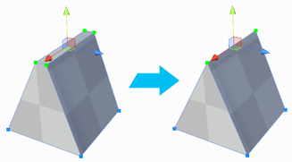

---

##  Collapse Vertices

Section Video: <a href="https://youtu.be/l9pQWme7wrY?list=PLrJfHfcFkLM-b6_N-musBp4MFaEnxpF6y">Vertex Actions: Collapse Vertices</a>

**Keyboard Shortcut** : `ALT C`

Collapses all selected vertices to a single point, regardless of distance.

 **Custom Settings Available** :

|**Setting:** |**Description:** |
|:---|:---|
|__Collapse To First__ |Collapse to first-selected vertex position, instead of selection center. |

##  Weld Vertices

Section Video: <a href="https://youtu.be/MaVDYQmT5Yg?list=PLrJfHfcFkLM-b6_N-musBp4MFaEnxpF6y">Vertex Actions: Weld Vertices</a>

**Keyboard Shortcut** : `ALT V`

Merge vertices within a set distance of one another.

 **Custom Settings Available** :

|**Setting:** |**Description:** |
|:---|:---|
|__Collapse To First__ |Collapse to first-selected vertex position, instead of selection center. |

##  Connect Vertices

Section Video: <a href="https://youtu.be/3wcSPqZy6Oc?list=PLrJfHfcFkLM-b6_N-musBp4MFaEnxpF6y">Vertex Actions: Connect Vertices</a>

**Keyboard Shortcut** : `ALT E`

Create a new edge connecting the selected vertices.

##  Split Vertices

Section Video: <a href="https://youtu.be/90_q4haZDZo?list=PLrJfHfcFkLM-b6_N-musBp4MFaEnxpF6y">Vertex Actions: Split Vertices</a>

**Keyboard Shortcut** : `ALT X`

Splits a vertex into it’s individual vertices so that they may be moved independently of one another.

> **Note** :  When a vertex is **Split**, the newly separated vertices will not actually move apart on their own. This was done for the image, to better illustrate the effect of this action.

