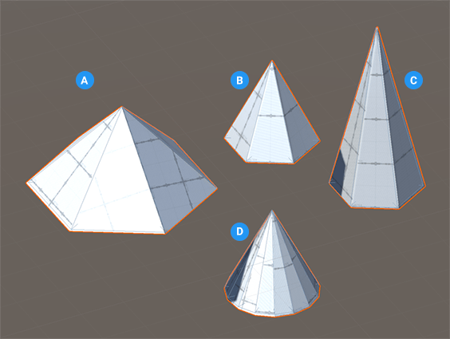

# Cone
A cone is a shape that tapers from a circular (or roughly circular) base to a point. You can adjust the smoothness.

 

**(A)** Cone with wide radius

**(B)** Basic cone shape (default values)

**(C)** Cone with increased height

**(D)** Cone with increased number of sides

You can customize the shape of a cone with this shape-specific property:

| **Property:** | **Description:** |
|:-- |:-- |
| __Sides Count__ | Set the number of sides for the cone. The more sides you use, the smoother the sides of the cone become. The default value is 6. Valid values range from 3 to 64. |
| **Smooth** | Enable this option to smooth the edges of the polygons. This property is enabled by default. |
