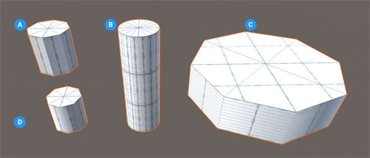

# Cylinder
A cylinder is a shape with long straight sides and two circular (or roughly circular) ends, like a tube. They have a radius and a height.

**(A)** Cylinder without a smoothing group

**(B)** Cylinder with a high sides count

**(C)** Cylinder with a lot of height cuts

**(D)** Default cylinder shape

You can customize the shape of a cylinder with these shape-specific properties:

| **Property:** | **Description:** |
|:-- |:-- |
| __Sides Count__ | Set the number of sides for the cylinder. The more sides you use, the smoother the sides of the cylinder become. The default value is 6. Valid values range from 4 to 64. |
| __Height Cuts__ | Set the number of divisions to use for the height of the cylinder. For example, a value of 3 produces 4 faces on every side of the cylinder. The default value is 0. |
| __Smoothing Group__ | Increase this value to make the edges of the polygons smoother. The default value is -1. |

**@DEV**: How does the Smooth value work? I tried different values (in smaller increments) and nothing seemed to make a difference. At first I though this was related to the Smooth Group Editor, but I tried to set up smoothing groups and it didn't seem to work. 