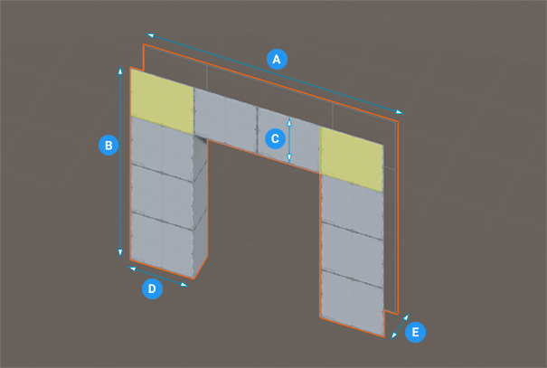

# Door
The ProBuilder door shape provides a convenient door Mesh that you can set into a level wall. There are no polygons where it meets the wall, so you can place it directly into the wall.

**(A)** Length (from the bounding box)

**(B)** Height (from the bounding box)

**(C)** **Pediment Height**

**(D)** **Side Width**

**(E)** Width (from the bounding box)

You can customize the shape of a door with these shape-specific properties:

| **Property:** | **Description:** |
|:-- |:-- |
| __Pediment Height__ | Set the height of the top of the door frame in meters. The default value is 0.5. The minimum value is 0.01. |
| __Side Width__ | Set the width of the door frame on the sides in meters. The default value is 0.75. The minimum value is 0.01. |
