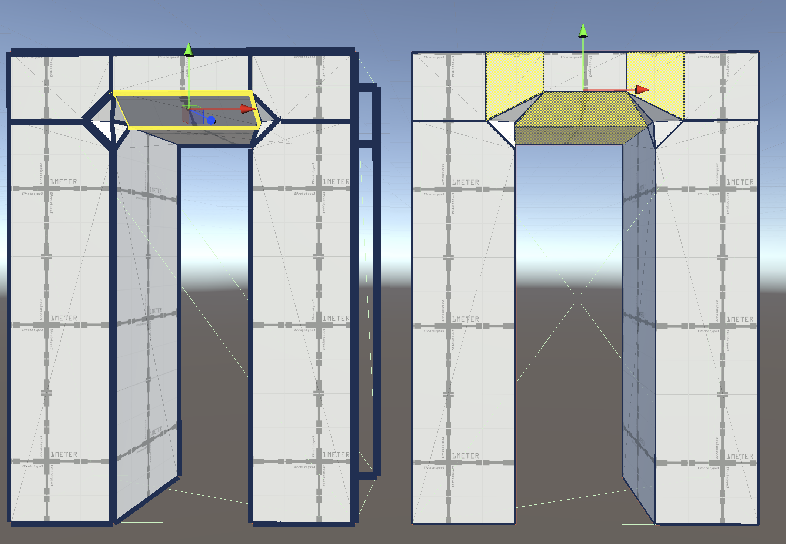

# Bevel Edges

To create a new face from an existing face or edge, use the __Bevel Edges__ action. If you bevel a face, all its edges create a new face. If you bevel an edge, only that edge creates a new face.

To bevel edges or faces:

1. In the **Tools** overlay, select the **ProBuilder** context.
1. In the **Tool Settings** overlay, select either:
    * The **Face** edit mode to bevel selected faces.
    * The **Edge** edit mode to bevel selected edges.
1. Select the face or edge to bevel. Hold **Shift** to select multiple faces or edges.
1. Do one of the following:
    * Right-click (macOS: **Ctrl**+click) on the selected face or edge and select **Bevel Edges**.
    * From the main menu, select **Tools** > **ProBuilder** > **Geometry** > **Bevel Edges**.
1. The **Bevel Edges** overlay opens and a new face is created.

## Bevel Edges options

To change the width of the new face, change the __Distance__ value, which defines the distance in meters between the original and new bevels. 

The minimum width is `0.0001`. The maximum width depends on the original shape, because the new face has to fit within it.

Select **Live Preview** to move the bevels as you change the distance value with the mouse. When **Live Preview** is off, the bevels update only when you release the mouse.
