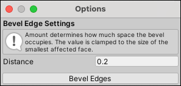

#  Bevel (Edge)

The __Bevel Edge__ action splits the selected edge(s) into two edges, with a new face between.

> **Tip:** You can also launch this action from the ProBuilder menu (**Tools** > **ProBuilder** > **Geometry** > **Bevel Edges**).

## Bevel Options

To change the width of the bevel, change the __Distance__ to move the newly created edge(s) from the position of the original edge(s). This becomes the width of the new face(s).

