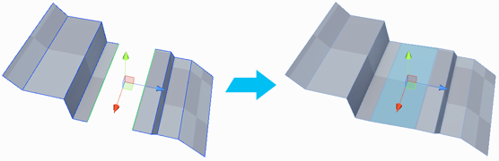

#  Bridge Edges

The __Bridge Edges__ action creates a new face between two selected edges.

By default, this action can only bridge two open edges (that is, no face on the open or free side). However, you can override this; to do so, navigate to the Preferences and enable [Allow non-manifold actions](preferences.md#bridge).

> **Tip:** You can also use this action with the **Alt/Opt+B** shortcut, or from the ProBuilder menu (**Tools** > **ProBuilder** > **Geometry** > **Bridge Edges**).
