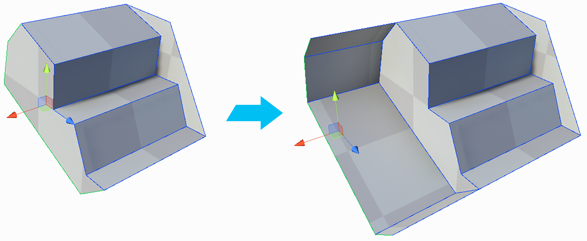
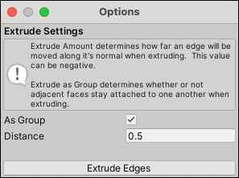

#  Extrude Edges

The __Extrude Edges__ action pushes a new edge out from each selected edge, connected by a new face for each edge. This action only works on open edges (that is, an edge that has no connected face on one side). However, you can override this restriction with the [Allow non-manifold actions](preferences.md#bridge) option.

Each new face follows the direction of the normals of the face that is adjacent to the selected edge.

You can invoke this action in either way:

- Select one or more edge(s) and click **Extrude Edges**. By default, the distance of the extrusion is **0.5**, but you can change that with the **Distance** option.

	> **Tip:** You can use the **Ctrl/Cmd+E** shortcut instead of the button with this method, or from the ProBuilder menu (**Tools** > **ProBuilder** > **Geometry** > **Extrude**).

- Select one or more edge(s) and then hold **Shift** while you move, rotate, or scale the selected edge(s). This method ignores the options but provides greater control, especially with the direction of the extrusion.

## Extrude Edges Options

These options apply only if you use the **Extrude Edges** button or the **Ctrl/Cmd+E** shortcut.

| **Property:**             | **Description:**                                           |
| :-------------------------- | :----------------------------------------------------------- |
| **As Group**                | Enable this option to keep the sides of extruded edges attached to each other if you select more than one edge to extrude. |
| __Distance__                | Distance to extrude the edge(s).  Both positive and negative values are valid. |
