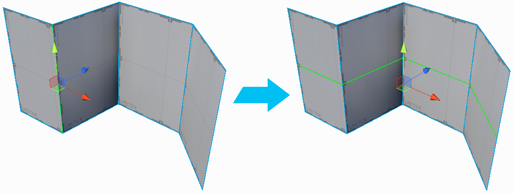

#  Insert Edge Loop

The __Insert Edge Loop__ action adds a new edge loop from the selected edge(s). An edge loop is a series of edges that are directly connected. They often encircle a 3D object and connect back at the origin point.

> **Note:** Loops only continue through quads (four-sided polygons), not triangles.

> **Tip:** You can also use this action with the **Alt/Opt+U** shortcut, or from the ProBuilder menu (**Tools** > **ProBuilder** > **Geometry** > **Insert Edge Loop**).

This creates more geometry than [Connect Edges](Edge_Connect.md) or [Connect Vertices](Vert_Connect.md), but it makes the geometry cleaner. For example, if you insert an edge on a single face of a cube you get a T-junction, but if you insert an edge loop instead, you get the same geometry all around the cube, provided that the loop is only passing through quads.

You can use **Insert Edge Loop** while you edit your geometry, and then delete the extra unnecessary edges when you're finished to optimize the geometry.
