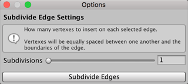

#  Subdivide Edges

The __Subdivide Edges__ action divides the selected edge(s) into multiple edges. By default, ProBuilder splits the edge in two, but in the Options window, you can set your own number of __Subdivisions__.

You can use this action with the **Alt/Opt+S** shortcut, or from the ProBuilder menu (**Tools** > **ProBuilder** > **Geometry** > **Smart Subdivide**).

## Subdivide Edges Options

To change the number of new edges created, change the __Subdivisions__ option. By default, the number of subdivisions is **1**, which means that ProBuilder splits a single selected edge into two edges. If you change this value to **3**, then a single edge becomes four edges.

By default, the range of valid values is **1** to **32**, but you can set your own range:

1. Click the arrow next to expand the **Subdivisions** section. The **Range** property appears.
2. Set the lower limit of the range on the left and the upper limit on the right.
