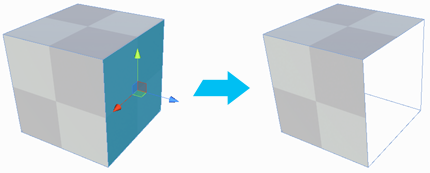

#  Delete Faces

The __Delete Faces__ tool deletes the selected face(s).

> **Tip:** You can also use this tool with the **Backspace** hotkey. The **Delete** key deletes the entire Mesh. You can use Undo to reverse it.

