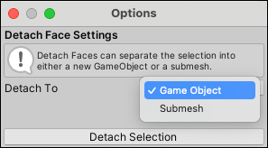

#  Detach Faces

The __Detach Faces__ action detaches the selected face(s) from the rest of the Mesh. 

> **Tip:** You can also launch this action from the ProBuilder menu (**Tools** > **ProBuilder** > **Geometry** > **Detach Faces**). 

> **Note:** When you detach a face, the newly separated Mesh remains in place. This image shows the detached Mesh above only to illustrate that the Mesh is now detached from the the rest of the original Mesh. 

By default, ProBuilder creates a new sub-Mesh for the detached face(s). If you want to keep it as a sub-Mesh inside the same GameObject, you can change the **Detach To** option.

## Detach Face Options

The __Detach To__ drop-down menu allows you to choose whether you want the detached face(s) to become a separate Mesh (the default), or keep them inside the original Mesh as a new sub-Mesh.

| **Choice:**   | **Result:**                                                |
| :-------------- | :----------------------------------------------------------- |
| **Game Object** | ProBuilder detaches the face(s) to a new, separate Mesh object. |
| **Submesh**     | ProBuilder detaches the face(s) to a sub-Mesh within the original Mesh object. |

