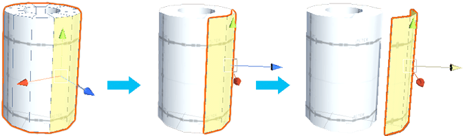
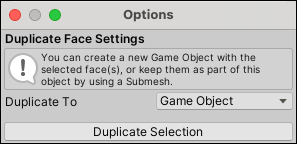

#  Duplicate Faces

The __Duplicate Faces__ action copies each selected face and either creates a new Mesh or leaves it in the same GameObject as a sub-Mesh, depending on the default options.

> **Tip:** You can also launch this action from the ProBuilder menu (**Tools** > **ProBuilder** > **Geometry** > **Duplicate Faces**).

## Duplicate Options

By default, when you duplicate a face, ProBuilder copies it into a new GameObject. However, you can choose the **Submesh** option from the **Duplicate To** drop-down menu to save it as a sub-Mesh in the same GameObject.

