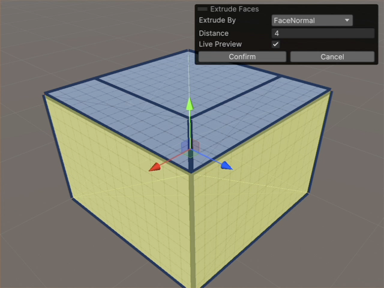
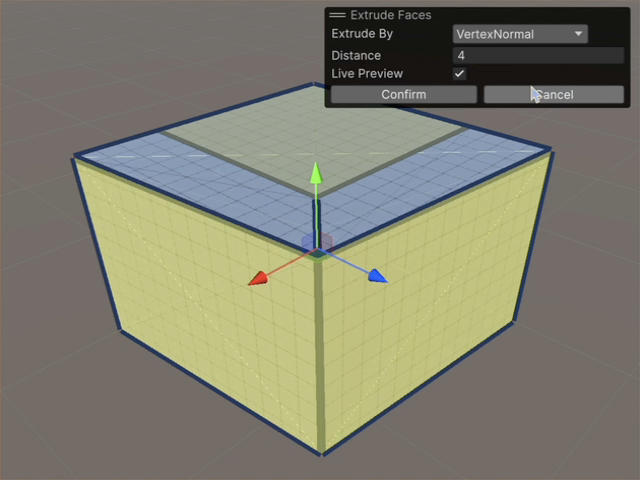
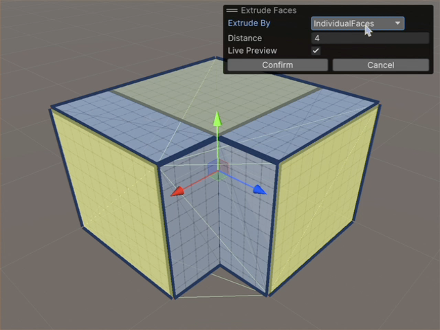

# Extrude Faces

The **Extrude Faces** action adds a section to your mesh by moving away the selected face and adding sides to connect it to the mesh from its new position. You can then either:

* Move the new section farther out and in any direction to make the shape larger.
* Inset the new section to create an interior space. For example, if you inset a face on a cube, you create a box with an open side and a false bottom. 

To extrude a face:

1. In the **Tools** overlay, select the **ProBuilder** context.
1. In the **Tool Settings** overlay, select the **Face** edit mode.
1. Select the face to extrude. Hold **Shift** to select multiple faces.
1. Do one of the following:
    * Right-click (macOS: **Ctrl**+click) on the selected face and select **Extrude Faces**.
    * From the main menu, select **Tools** > **ProBuilder** > **Geometry** > **Extrude**.
1. The **Extrude Faces** overlay opens and a new face is created.
    * By default, the new face follows the direction of its vertex normals. You can change this with the **Extrude By** option.
    * By default, the distance of the extrusion is **0.5**. You can change this with the **Distance** option. A negative value creates an inset.
    * You can use the Transform tools to move, rotate, or scale the new face instead of using the options in the overlay. Hold **Shift** for greater control. 

## Extrude Faces Options

| **Property** |   | **Description** |
| :--- | --- | --- |
| **Extrude By** |   | When you extrude more than one face, and those faces share an edge, set how the new faces behave along the shared edge. |
|  | **Face Normals** | Each new face follows the direction of its original face, and the faces are connected to each other. |
|  | **Vertex Normals** | The edges of the new faces farthest from the joint edge follow the direction of the original faces. However, the faces move toward the shared edge rather than follow the original direction for their whole length. |
|  | **Individual Faces** | Each new face follows the direction of its original face, but the faces aren't connected to each other. |
| **Distance** |   | Distance to extrude the faces(s). Use negative values to inset the face, and define inset. |

