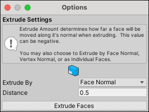

#  Extrude Faces

The __Extrude Faces__ action creates a new face. To do this, it pulls out the currently selected face, and attaches sides to each edge.

By default, each new face follows the direction of its vertex normals, but you can change this with the **Extrude By** option.

You can invoke this action in either way:

- Select one or more face(s) and click **Extrude Faces**. By default, the distance of the extrusion is **0.5**, but you can change that with the **Distance** option.

  > **Tip:** You can also use this action with the **Ctrl/Cmd+E** shortcut, or from the ProBuilder menu (**Tools** > **ProBuilder** > **Geometry** > **Extrude**).

- Select one or more face(s) and then hold **Shift** while moving, rotating, or scaling the selected face(s). This method ignores the options but provides greater control, especially with the direction of the extrusion.

	When you use this method with the scaling control, it creates an inset.

## Extrude Faces Options

These options only apply if you are using the **Extrude Faces** button or the **Ctrl/Cmd+E** shortcut.

| **Property:** |                                                              | **Description:**                                           |
| :-------------- | ------------------------------------------------------------ | ------------------------------------------------------------ |
| **Extrude By**  |                                                              | Direction for extruding each selected face.                  |
|                 |  **Face Normals** | Use the selected face's own surface direction. Adjacent faces remain connected. |
|                 |  **Vertex Normals** | Use the selected face's Vertex normals. Adjacent faces remain connected.  This is the default. |
|                 |  **Individual Faces** | Use the selected face's own surface direction. However, adjacent faces do *not* remain connected. |
| __Distance__    |                                                              | Distance to extrude the faces(s).  Both positive and negative values are valid. |
