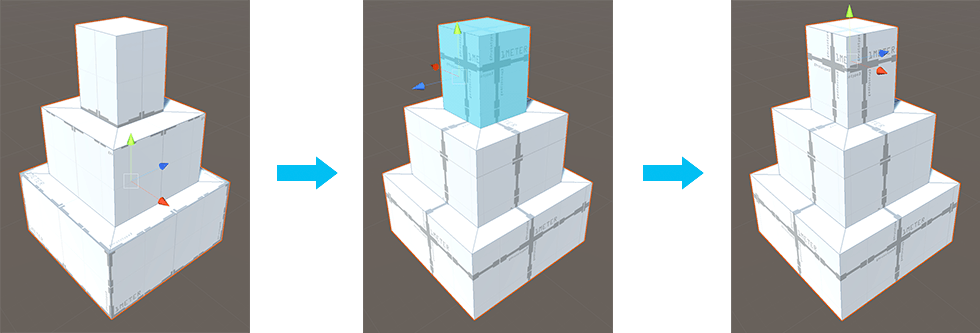

#  Set Pivot (Faces)

Use the __Set Pivot__ action to move the pivot point of this Mesh to the average center of the selected faces.

You can launch this action with the **Ctrl/Cmd+J** shortcut, or from the ProBuilder menu (**Tools** > **ProBuilder** > **Geometry** > **Set Pivot**). 

In this example:
* **Left panel**: The pivot point of the block tower is at the center of the entire Mesh.
* **Middle panel**: The top faces are selected, so the Set Pivot action changes the pivot to the center of those top faces.
* **Right panel**: The pivot point is now at the top, even when in Object editing mode.
