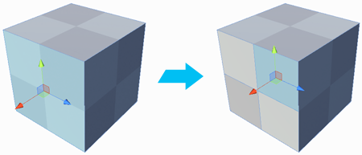

#  Subdivide Face

The __Subdivide Face__ tool splits each selected face. To do this, it adds a vertex at the center of each edge and connects them in the center.

> **Tip:** You can also use this tool with the **Alt/Opt+S** hotkey.

This allows you to add a lot more detail to your geometry.

