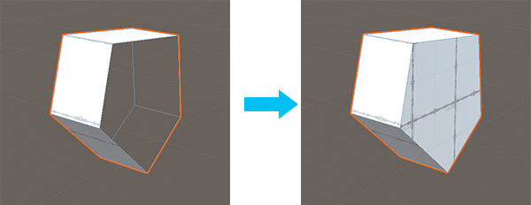

#  Conform Normals (Objects)

The __Conform Normals__ action sets all face normals on the selected object to the same relative direction. 

ProBuilder uses the direction that most of the faces on the object are already facing.

In this example, the majority of the normals on this shape are pointing towards the Camera, so after applying this action, all normals point in the same direction.

From the main menu, select **Tools** > **ProBuilder** > **Object** > **Conform Object Normals**.