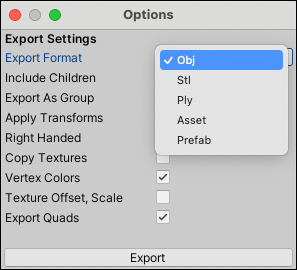
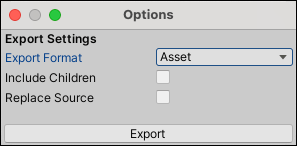
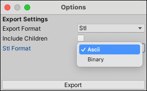
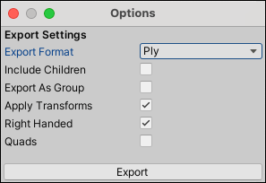
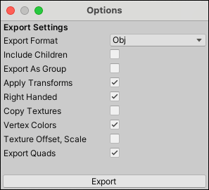

#  Export

The __Export__ action [exports](workflow-exporting.md#export) the selected ProBuilder object(s) to a 3D Model file.

> **Tip:** You can also export to each format by selecting the specific format from the ProBuilder menu (**Tools** > **ProBuilder** > **Export** > **Export &lt;format&gt;**).

For an overview of how to export ProBuilder objects and and re-import the exported files, see [Exporting and re-importing](workflow-exporting.md).

## Export options

Select the [format you want to export to](workflow-exporting.md#formats) from the **Export Format** drop-down menu. The options available depend on which format you choose:

* [OBJ-specific options](#Obj)
* [STL-specific options](#STL)
* [PLY-specific options](#PLY)
* [Asset-specific options](#Asset)
* [Prefab-specific options](#Prefab)

The only option that applies to all file format types is the __Include Children__ property, which you can enable to include not only selected Meshes, but also the child objects of selected objects in the exported Model.

### Asset-specific options

The Asset format type also provides the **Replace Source** option.

[!include]

### STL-specific options

The STL format type also provides the __STL Format__ option, which lets you choose whether to use the **ASCII** or **Binary** representation of the STL file specification.

### PLY-specific options

The PLY format type also provides the following options:

| **Property:**        | **Description:**                                             |
| :------------------- | :----------------------------------------------------------- |
| __Export As Group__  | Enable this option to combine all selected objects and export them as a single Model file. Otherwise, ProBuilder exports each Mesh separately. |
| __Apply Transforms__ | Enable this option to apply the GameObject transform to the Mesh attributes before ProBuilder exports them. With both this option and **Export as Group** enabled, you can export your whole Scene, edit it, then re-import it with everything exactly where you left it. |
| __Right Handed__     | Enable this option to use right-handed coordinates. Unity's coordinate system is left-handed, but most major 3D modeling software applications use right-handed coordinates. |
| __Quads__            | Enable this option to preserve quads where possible.         |

### OBJ-specific options

The OBJ format type also provides the following options:

| **Property:**             | **Description:**                                             |
| :------------------------ | :----------------------------------------------------------- |
| __Export As Group__       | Enable this option to combine all selected objects and export them as a single Model file. Otherwise, ProBuilder exports each Mesh separately. |
| __Apply Transforms__      | Enable this option to apply the GameObject transform to the Mesh attributes before exporting. With this option and **Export as Group** enabled, you can export your whole Scene, edit, then re-import it with everything exactly where you left it. |
| __Right Handed__          | Enable this option to use right-handed coordinates. Unity's coordinate system is left-handed, but most major 3D modeling software applications use right-handed coordinates. |
| __Copy Textures__         | Enable this option to copy texture maps to the file destination and reference them from local paths in the Material library.  Disable it if you want the Material library to reference an absolute path to the Textures instead of copying them. See [Re-importing an exported Mesh](workflow-exporting.md#reimport) for more information. |
| __Vertex Colors__         | Enable this option to write vertex colors with the MeshLab format. Some 3D modeling applications can import vertex colors from an unofficial extension to the OBJ format.   **Note:** This can break import in some applications, so use it with caution. |
| __Texture Offset, Scale__ | Enable this option to write import texture scale and offset parameters values to the exported mtlib file. Some 3D modeling applications import texture scale and offset parameters (Blender, for example).   **Note:** This can break import in some applications, so use it with caution. |
| **Export Quads**          | Enable this option to preserve quads where possible.         |

### Prefab-specific options

The [Prefab](https://docs.unity3d.com/Manual/Prefabs.html) format type also provides the **Replace Source** option.

[!include]
