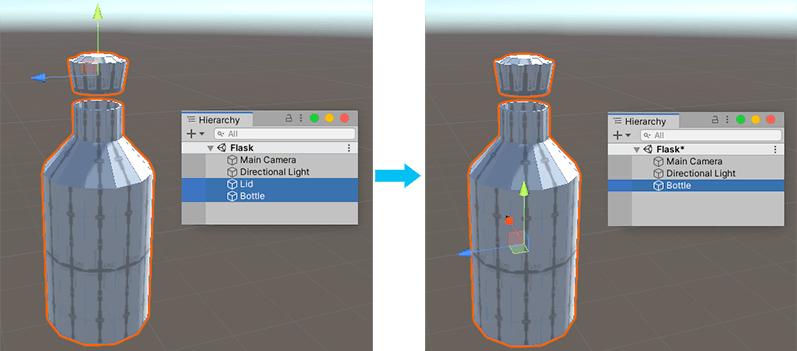

#  Merge Objects

The __Merge Objects__ action merges two or more selected ProBuilder GameObjects into a single ProBuilder GameObject.

> **Warning:** If you merge two objects that intersect, the new object might have overlapping UVs.

> **Tip:** You can also launch this action from the ProBuilder menu (**Tools** > **ProBuilder** > **Object** > **Merge Objects**).

