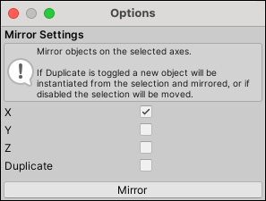

#  Mirror Objects

The __Mirror Objects__ action creates mirrored copies of objects.

Mirroring is especially useful when you want to create symmetrical items. You can build one half, mirror it, and then [Weld](Vert_Weld.md) the two Meshes together for a perfectly symmetrical result.

From the main menu, select **Tools** > **ProBuilder** > **Object** > **Mirror Objects**.

## Mirror Objects Options

| **Property:** | **Description:**                                           |
| :-------------- | :----------------------------------------------------------- |
| __X, Y, Z__     | Check each axis you want to mirror on. You can choose one axis only, or multiple axes. |
| __Duplicate__   | Enable this option to create a duplicate object and mirror it, leaving the original unchanged. |

Set these properties, then click **Mirror**.
