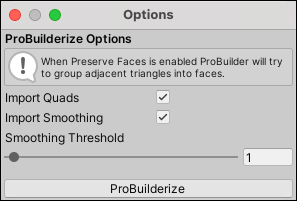

#  ProBuilderize

The __ProBuilderize__ tool converts the selected object(s) into ProBuilder-editable objects.

## ProBuilderize options

| **Property:**         | **Description:**                                           |
| :---------------------- | :----------------------------------------------------------- |
| __Import Quads__        | Enable this option to keep Meshes quadrangulated when ProBuilder imports them.  Disable it to import the Mesh as triangles. |
| __Import Smoothing__    | Enable this option to use a smoothing angle value to calculate [smoothing groups](smoothing-groups.md). |
| __Smoothing Threshold__ | Set this value to decide which adjacent faces to add to a smoothing group. Use a value that is higher than the difference of any adjoining angle that is adjacent to the face(s) you want to add to a smoothing group. This setting is only available if __Import Smoothing__ is enabled. |

