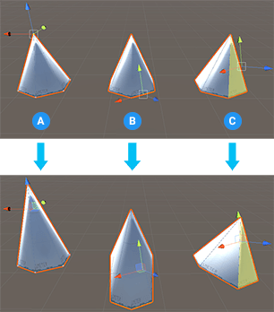
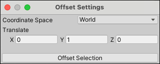

#  Offset Elements

The __Offset Elements__ action moves the selected element(s) according to the default values. You can change the default values with the **Offset Settings**. 

This tool is available in Vertex, Edge, and Face edit mode and appears as **Offset Vertices**, **Offset Edges**, and **Offset Faces** on the text buttons on the ProBuilder toolbar.

From the main menu, select **Tools** > **ProBuilder** > **Geometry** > **Offset Elements**.

## Offset Elements options

Using the Offset Settings lets you enter a precise value to move vertices, edges, and faces.

### Coordinate space

Select the relative space for moving the elements.

| **Property** | **Description** |
| --- | --- |
| **World** | Move the element in world space. This is the default. |
| **Local** | Move the element relative to the GameObject. |
| **Element** | Move the element relative to the itself. |
| **Handle** | Moves the element relative to the handle. |

### Translate

Set positive or negative values to move for each axis. By default, **X** and **Z** are set to `0` and **Y** is set to `1`.

