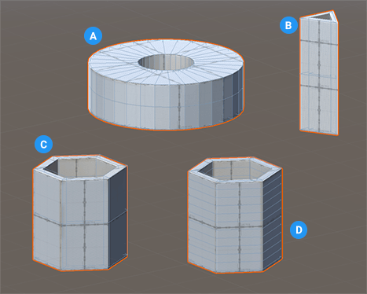

# Pipe
The pipe shape is similar to the ProBuilder [Cylinder](Cylinder.md), but hollow. It has similar properties, but you can also specify the thickness of the pipe wall.

**(A)** Pipe with increased number of sides and thickness

**(B)** Pipe with only three sides 

**(C)** Basic pipe shape (default values)

**(D)** Pipe with increased number of height segments (faces per side)

You can customize the shape of a pipe with these shape-specific properties:

| **Property:** | **Description:** |
|:-- |:-- |
| __Thickness__ | Set the thickness of the walls of the pipe in meters. The thicker the value, the smaller the hole becomes. The default value is 0.25. The minimum value is 0.01. |
| __Sides Count__ | Set the number of sides for the pipe. The more sides you use, the smoother the sides of the pipe become. The default value is 6. Valid values range from 3 to 64. |
| __Height Cuts__ | Set the number of divisions to use for the height of the pipe. For example, using a value of 3 produces four faces on every side of the pipe. The default value is 0. Valid values range from 0 to 31. |
| **Smooth** | Enable this option to smooth the edges of the polygons. This property is enabled by default. |
