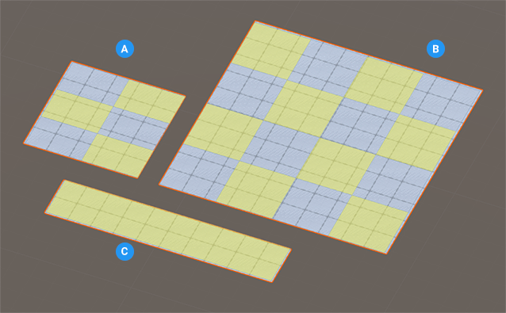

# Plane
A plane is a four-sided 2D shape. It can be a square or a rectangle, with two dimensions (width and height) in any orientation.

**(A)** Square plane with 2 subdivisions along the width and 1 along the length 

**(B)** Square plane with 3 equal subdivisions along both the width and the length 

**(C)** Rectangular plane with no subdivisions

You can customize the shape of a plane with these shape-specific properties:

|**Property:** |**Function:** |
|:---|:---|
| __Width Cuts__ | Set the number of divisions to use for the width of the plane. For example, if you use a value of 3, ProBuilder produces a plane with four "columns". If you specify 3 for both the __Width Cuts__ and __Height Cuts__, ProBuilder builds a plane with 16 faces. The default value is 1. The minimum value is 0. |
| __Height Cuts__ | Set the number of divisions to use for the length of the plane. For example, using a value of 3 produces four "rows". If you specify 2 for both the __Width Segments__ and 1 for the __Length Segments__, ProBuilder builds a plane with six faces. The default value is 1. The minimum value is 0. |
