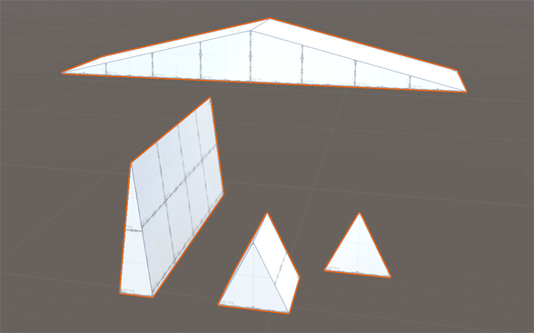

# Prism
A prism is a shape with two identical ends and flat sides. The basic ProBuilder prism is like a three-dimensional triangle, stretched along the z-axis.

The prism shape has no shape-specific properties.