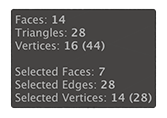

# Scene Information

The **Scene Information** overlay displays information about the selected mesh and selected elements of that mesh.

To display the **Scene Information** overlay:

1. In the [Preferences](preferences.md#info_overlay) window, enable **Show Scene Info**.
1. Set the [active context](modes.md) to ProBuilder.

