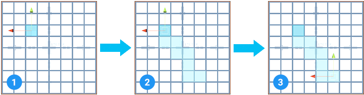

# Select Path

Use Select Path to show and select a path from the face underneath the cursor to the selected face on the surface of a Mesh.

You can move your mouse to test different paths to the selected face and then click to select the path you want to select.

To select a path of faces:

1. In [Face mode](modes.md), select the face you want to build a path to.
2. Hold both **Ctrl/Cmd** and **Shift** while you move your cursor around to see options for which faces ProBuilder might select. As you move, ProBuilder shows a preview of which faces you can select.
3. When you see the pattern of faces that you want to select, click in place. ProBuilder grows the selection to include all the faces in that path.

> **Note**: This action is only available with the **Ctrl/Cmd**+**Shift**+**click** shortcut when the [UV Editor window](uv-editor.md) is closed. No menu or toolbar button activates this action, and you can't remap the shortcut.