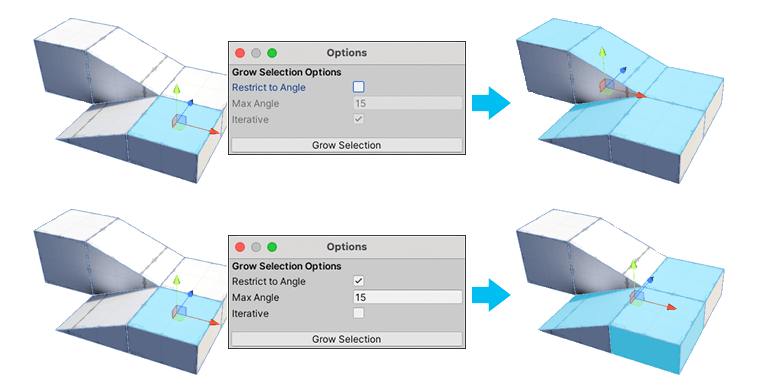
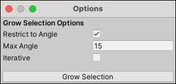

#  Grow Selection

The __Grow Selection__ action expands the selection outward to adjacent faces, edges, or vertices.

This action is available in the [vertex, edge, and face modes](modes.md).

> **Tip:** You can also use this action with the **Alt/Opt+G** shortcut, or from the ProBuilder menu (**Tools** > **ProBuilder** > **Selection** > **Grow Selection**).

## Grow Selection Options

| **Property:**       | **Description:**                                           |
| --------------------- | ------------------------------------------------------------ |
| **Restrict To Angle** | Enable this property to grow the selection only to those faces within a specified angle. |
| **Max Angle**         | Set the maximum angle allowed when growing the selection. ProBuilder ignores this property and prevents you from editing it unless the __Restrict to Angle__ property is enabled. |
| **Iterative**         | Enable this property to grow the selection one adjacent face at a time, each time you press the **Grow Selection** button. This property is enabled automatically (and is not editable) if the __Restrict to Angle__ property is disabled. |
