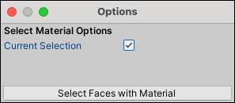

#  Select by Material

The __Select by Material__ tool selects all faces on this object which have the same Material as the selected face(s). You can also extend the selection to other GameObjects if you disable the **Current Selection** option.

This tool is useful if you want to replace all Materials on a complex object. It is only available in [face mode](modes.md).

> **Tip:** You can also access this tool from the ProBuilder menu (**Tools** > **ProBuilder** > **Selection** > **Select Material**).

## Select by Material Options

By default, the **Current Selection** option is enabled. This means that ProBuilder only extends the selection to other faces on the currently selected GameObject. 

Disable this option if you want to select every face that has a matching Material on any GameObject in the Scene. This is particularly useful if you want to replace this Material with another on every GameObject in the Scene at once.

 