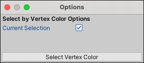

#  Select by Colors

The __Select by Colors__ selects all faces on this object which have the same vertex color as the selected face. You can also extend the selection to other GameObjects if you disable the **Current Selection** option.

Even if the vertex color isn't currently visible (for example, if it has a Material that doesn't show colors, like the checkerboard Material), the colored faces are still selected.

This action is useful for grouping out sections of your Mesh with different vertex colors. It is available in the [vertex, edge, and face modes](modes.md).

> **Tip:** You can also access this action from the ProBuilder menu (**Tools** > **ProBuilder** > **Selection** > **Select Vertex Color**).

## Select by Colors Options

Enable the **Current Selection** option to extend the selection to other faces on the currently selected GameObject(s). By default, this option is disabled. 

When disabled, ProBuilder selects every face with the currently selected vertex color on any GameObject in the scene.

