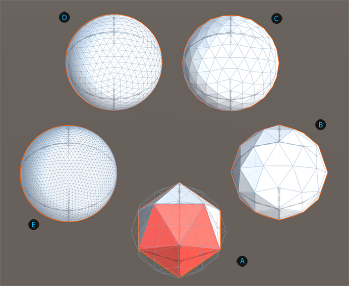

# Sphere
A sphere is a perfectly round 3D object. In ProBuilder, a sphere is actually an icosahedron with a minimum of 42 vertices (for 1 subdivision) shared across multiple triangles (faces). When you increase the subdivisions, the shape looks smoother, more sphere-like, but the geometry also becomes more complex. For example, with 2 subdivisions, the shape has 162 vertices; and for 5 subdivisions (the maximum), the shape has 2562 vertices.

**(A)** Default sphere (three subdivisions).

**(B)** Sphere with two subdivisions.

**(C)** Sphere with four subdivisions.

**(D)** Sphere shape with no subdivisions showing five triangles colored. A wireframe of a default sphere is superimposed on that shape (the same size but with one subdivision).

**(E)** Sphere shape (one subdivision).

You can customize the shape of a sphere with this shape-specific property:

| **Property:** | **Description:** |
|:-- |:-- |
| __Subdivisions__ | Set the number of times to subdivide each triangle. The default value is 3. Valid values range from 1 to 5.  The more subdivisions you create, the smoother the sphere appears. However, remember that each subdivision increases the number of triangles exponentially, which means that it uses a lot more resources to render. |
| **Smooth** | Enable this option to smooth the edges of the polygons. This property is enabled by default. |
