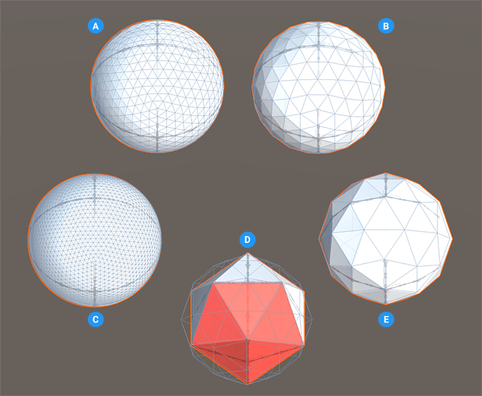

# Sphere
A sphere is a perfectly round 3D object. In ProBuilder, a sphere is actually a polygon with 42 vertices, in which five triangles (faces) share each vertex.

**(A)** Default sphere (three subdivisions).

**(B)** Sphere with two subdivisions.

**(C)** Sphere with four subdivisions.

**(D)** Sphere shape with no subdivisions showing five triangles colored. A wireframe of a default sphere is superimposed on that shape (the same size but with one subdivision).

**(E)** Sphere shape (one subdivision).

You can customize the shape of a sphere with this shape-specific property:

| **Property:** | **Description:** |
|:-- |:-- |
| __Subdivisions__ | Set the number of times to subdivide each triangle. The default value is 3. Valid values range from 0 to 5.  The more subdivisions you create, the smoother the sphere appears. However, remember that each subdivision increases the number of triangles exponentially, which means that it uses a lot more resources to render. |
