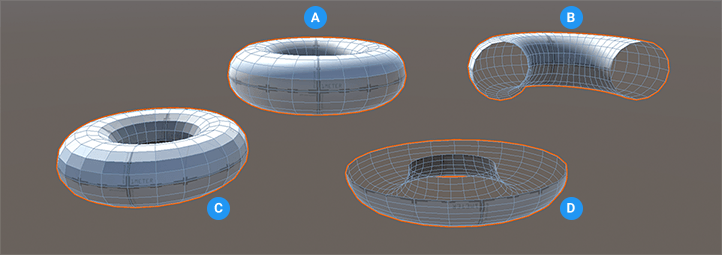

# Torus
A torus is a 3D shape formed by a small circle that rotates around a bigger circle. It usually looks like a circular ring, or a donut.

**(A)** Default torus (smooth)

**(B)** Torus with 180-degree **Horizontal Circumference**

**(C)** Torus with the **Smooth** property set to false

**(D)** Torus with 180-degree **Vertical Circumference**

You can customize the shape of a torus with these shape-specific properties:

| **Property:** | **Description:** |
|:-- |:-- |
| __Rows__ | Set the complexity of the Mesh, together with the __Columns__ value. You can enter a value from 3 to 64. The higher the value, the smoother the shape, but at the cost of more polygons to calculate. The default value is 16. |
| __Columns__ | Set the complexity of the Mesh, together with the __Rows__ value. You can enter a value from 3 to 64. The higher the value, the smoother the shape, but at the cost of more polygons (and therefore more computation). The default value is 24. |
| __Tube Radius__ | Set the radius of the tube itself in meters. The default value is 0.1. |
| __Horizontal Circumference__ | Set the degree of the torus's circumference. For example, if you set this value to 180 (as the **(B)** image above demonstrates), it looks like someone cut half of the torus away (like leaving half of a donut). The default value is 360 (full torus). |
| __Vertical Circumference__ | Set the degree of the tube's circumference. For example, if you set this value to 180 (as the **(D)** image demonstrates), it looks like a half-pipe. The default value is 360 (full tube). |
| __Smooth__ | Enable this option to smooth the edges of the polygons. This property is enabled by default. |

