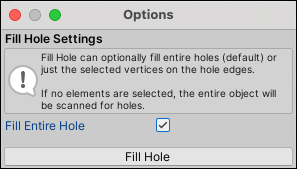

#  Fill Hole (Vertices)

The __Fill Hole__ action creates a new face that fills any holes that touch the selected vertices.

> **Tip:** You can also launch this action from the ProBuilder menu (**Tools** > **ProBuilder** > **Geometry** > **Fill Hole**).

## Fill Hole Options

Enable the __Fill Entire Hole__ option to fill the entire Mesh opening. This is enabled by default.

If you disable this option, ProBuilder tries to build a Mesh between the selected open vertices. For example, if you have a missing quad, you can select any three adjacent vertices in order to create a triangular polygon that covers half of the hole.
