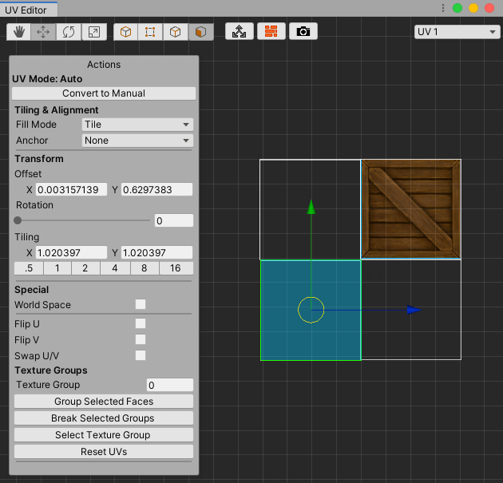
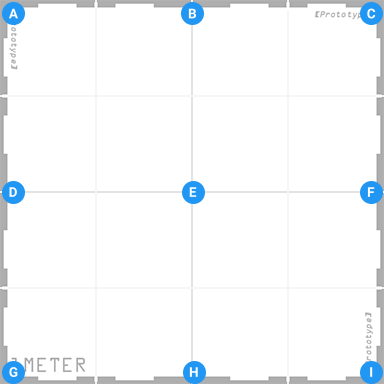

# Actions panel: Auto UV Mode

In Auto mode, the **Actions** panel displays the **UV Mode: Auto** label and the settings for automatic texture mapping. To access this panel, click the **Convert to Auto** button from the [Actions panel in Manual UV Mode](manual-uvs-actions.md).

The Auto mode provides the following features to help you with texture mapping:

* The [Tiling &amp; Alignment](#Alignment) section defines the Texture's basic layout.
* The [Transform](#Transform) section helps you set the position, orientation, and scaling in U and V.
* The [Special](#Special) section provides settings for changing UV direction.
* The [Texture Groups](#Groups) section helps you manage tiling across multiple faces using Texture groups.
* Click the **Reset UVs** button when you want to clear any edits you made on the selected face(s). This can be very useful, especially if you are just learning how to use ProBuilder for texture mapping.

To switch back to the **Actions** panel in **Manual UV Mode** and convert all selected faces to [use manual UVs](manual-uvs-actions.md), click the **Convert to Manual** button.

> **Tip:** When you convert from Auto UVs to Manual there is no loss of resolution. However, if you modify vertices or edges individually in Manual mode, those changes don't transfer over to Auto mode.

These settings are interconnected: if you change a **Transform** setting, it might affect something you previously set under the **Tiling &amp; Alignment** section. For example, the **Anchor** refers to a location on the original UV face that has a **Tiling** value of 1. If you change the **Tiling** (scale) value, you might need to readjust the **Offset** to compensate.

## Tiling &amp; Alignment

Use the **Fill Mode** and **Anchor** properties to define how you want the image to appear across the selected face(s). These are basic guidelines for ProBuilder to be able to manage the Texture projection automatically. For more precise controls, use the [Manual mode](manual-uvs-actions.md) instead.

### Fill Mode

The **Fill Mode** defines how to treat the UV image; whether to repeat it (to create a tile effect), stretch it, or fit it along the U or V axis.

|**Value** |**Function** |
|:---|:---|
|__Tile__ |Continuously tile (repeat) the UVs across the object. |
|__Fit__ |Uniformly scale UVs to size. |
|__Stretch__ |Expand the selection on all sides to fill space. |

> **Note:** Certain configurations on the [Transform](#Transform) and [Special](#Special) settings can neutralize the effect of the **Fill Mode**. For example, if you use the **Stretch** mode and you reduce the **Tiling** value (scale up the UV face), the UV might no longer show the entire image.

### Anchor

Define where on the UV face the texture image appears. ProBuilder projects the image from the selected anchor point, so if you set it to **Lower Left**, the image projects up and to the right.

By default this is set to **None**, but you can select any of the following points:

| **Left anchors** | **Center anchors**  | **Right anchors**  |
| :--- | :--- | :--- |
| **(A)** __Upper Left__  | **(B)** __Upper Center__  | **(C)** __Upper Right__  |
| **(D)** __Middle Left__ | **(E)** __Middle Center__ | **(F)** __Middle Right__ |
| **(G)** __Lower Left__  | **(H)** __Lower Center__  | **(I)** __Lower Right__  |

Anchor points represent a point on the original UV face (before you scale or tile it).

## Transform

The **Transform** section allows you to set precise values for the 2-dimensional size, rotation, and scale of the UV faces relative to the Texture image. When you modify these values, the changes appear in the UV Viewer.

Alternatively, you can also manipulate the **Offset**, **Rotation**, and **Tiling** directly in the UV Viewer with the standard Unity Transform controls.

> **Note:** You can only change transform values for a  face. If you try to switch to the  vertex or  edge [UV editing modes](edit-mode-toolbar.md), the UV Editor changes the Actions panel to [Manual UV Mode](manual-uvs-actions.md).

### Offset

Enter exact offset **X** and **Y** values, or drag the input fields to adjust.

The offset value represents an offset from the **Anchor** position along the U or V axis.

### Rotation

Enter exact rotation values here in degrees (0-360), or drag the slider to adjust.

Don't forget that you are rotating the UV face, not the image. As you rotate the UV face to the right in the UV Viewer, the image projected on the Mesh face in the Scene view rotates to the left.

### Tiling

There are three ways to change the size of a UV face in the UV Editor:

* Enter exact scale values in the **X** and **Y** properties for each axis. These values represent the size of the UV face relative to the Texture. For example, when you enter a value of 0.5 in **Y**, this halves the height of the UV face on the image, whereas a value of 2 in **X** doubles the width.
* Select the appropriate preset button to set how many times you want the Texture image to appear across the UV face. For example, the **.5** preset only displays half the image: in the viewer, the UV face appears twice as large against the image, but in the Scene view, you can only see half of the image on the Mesh face. Conversely, using the **4** preset results in the image tiling four times across the Mesh face in the Scene view, so the UV face in the Viewer appears to be a quarter the size of the image.
* Select and drag on the scale gizmo to scale the UV face directly in the UV Viewer.

In all three cases, ProBuilder updates the **X** and **Y** **Tiling** values to reflect any changes.

## Special

These options help you control the Texture direction.

### World Space

Enable this option to align UVs to the World. This ensures Textures on same-angle faces always line up, but UVs do not stay put when you move the object.

### Flip U

Enable this option to flip the UVs horizontally.

### Flip V

Enable this option to flip the UVs vertically.

### Swap U/V

Enable this option to invert the horizontal and vertical UVs.

## Texture Groups

Use Texture Groups to keep consistent tiling across several faces as if they were one. Each face in the group must share an edge with at least one other face in the group.

### Texture Group Number

Displays the Texture Group ID of the currently selected face, or 0 if the face doesn't belong to a Texture Group.

You can also assign the currently selected face(s) to an existing group if you already know the group's number. To do this, enter it in the **Texture Group Number** box.

### Group Selected Faces

Click the **Group Selected Faces** button to create a new Texture Group from the selected face(s).

### Select Texture Group

Click the **Select Texture Group** button to select all faces in the the group.

