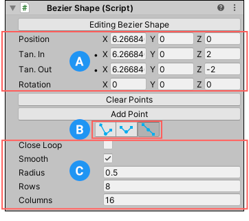
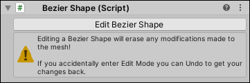
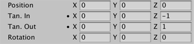

# Bezier Shape component

> **Warning:** Bezier shapes are experimental, meaning that they are still under development, and might reduce ProBuilder's stability. Please use with caution.

Use the Bezier Shape tool to [create a more organic shape](workflow-create-bezier.md) by defining a spline along which ProBuilder extrudes a 3-dimensional Mesh. When you activate the Bezier Shape tool to create a new shape, the **Bezier Shape** component provides properties that help you customize the new shape. After you activate the tool, the Bezier Shape is ready for editing:

**(A)** [Curve property values](#curve)

**(B)** [Tangent modes](#tangent)

**(C)** [Shape property values](#shape)

> **Note:** You can modify Mesh elements on the Bezier Shape Mesh with the standard ProBuilder editing tools and actions. However, each time you re-enter Bezier Shape editing mode, you lose any element changes.

## Editing a Bezier Shape

When you are in Bezier Shape editing mode, the **Bezier Shape** component in the Inspector displays the **Editing Bezier Shape** button. If you are not in Bezier Shape editing mode, the **Edit Bezier Shape** button appears instead:

To enter the Bezier Shape editing mode, click the **Edit Bezier Shape** button.  To exit the Bezier Shape editing mode, select the button (**Editing Bezier Shape**) again.

In Bezier Shape editing mode, you can modify the shape. To do this, perform the following tasks in the Scene view:

* Click and drag existing control points to move them around. When you select control points, translation and rotation handles appear for more precise control.
* Click existing control points to select them, then use **Backspace** (Windows) or **Delete** (macOS) to remove the points from the shape.
* Click along the bezier path line to add new control points.

In the Inspector, you can also use the controls in the **Bezier Shape** component to:

- Enter [Curve property values](#curve) (position, rotation, tangent) directly.
- Click the __Clear Points__ button to clear all control points on the Mesh. 
- Click the __Add Point__ button to add a new control point at the end of the Bezier path.
- Change the [Tangent mode](#tangent) to use for the handles.
- Customize the overall look of the shape by setting the [Shape property values](#shape).

## Curve property values

Use these property values to set precise values for the curve's position, rotation, and tangent handles.

| **Property:** | **Description:**                                           |
| :-------------- | :----------------------------------------------------------- |
| __Position__    | Enter the local position of the selected control point.      |
| __Tan. In__     | Enter the local position of the selected control tangent in handle. |
| __Tan. Out__    | Enter the local position of the selected control tangent out handle. |
| __Rotation__    | Enter the additional rotation to be applied to the vertices of the extruded tube. |

## Tangent modes

Tangent modes change how much control you have over the tangent handles.

| **Icon**                              | **Tangent Mode** | **Description**                                            |
| :-------------------------------------- | :----------------- | :----------------------------------------------------------- |
|          | **Free**           | Adjusting one tangent does not affect the other.             |
|    | **Aligned**        | Adjusting one tangent forces the other tangent's magnitude to match. |
|  | **Mirrored**       | Locks tangent handles in a straight line.                    |

## Shape property values

Use these property values to set some basic characteristics of the Bezier Shape.

| **Property:** | **Description:**                                           |
| :-------------- | :----------------------------------------------------------- |
| __CloseLoop__   | Enable this option to loop the extruded path back around to the start point. |
| __Smooth__      | Enable this option to use soft normals for the extruded pipe faces. Disable it for hard normals. |
| __Radius__      | Enter the radius of the extruded pipe.                       |
| __Rows__        | Enter the number of segments to insert between control points when extruding the pipe. |
| __Columns__     | Enter the number of vertices that make up the ring around the radius of the pipe. |

