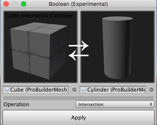
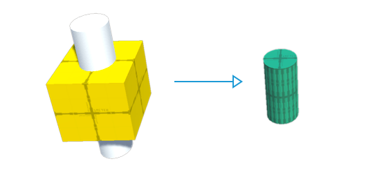
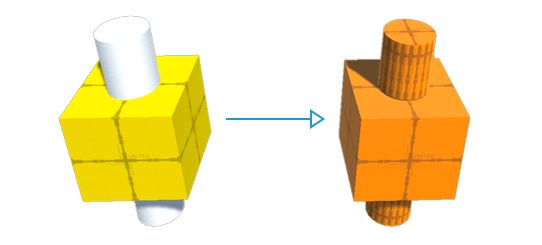
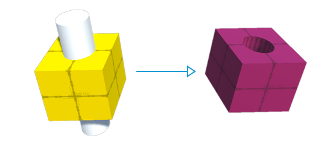

# Boolean operations

> **Warning:** The Boolean feature is experimental, meaning that it is still under development, and might reduce ProBuilder's stability. Please use with caution.

The experimental Boolean features provides an interface for creating new Meshes from boolean operations.

Each type of operation takes two ProBuilder Mesh objects as the left and right inputs. ProBuilder combines the two input Meshes to create a new Mesh shape based on the operation you select.

You can only access this feature from the menu, because it is experimental:

1. To open the Boolean (Experimental) window, navigate to Unity's top menu and go to **Tools** > **ProBuilder** > **Experimental** > **Boolean (CSG) Tool**.
2. Set references to the ProBuilder Meshes just under the preview windows on the left and the right side.
3. Select one of the boolean operation types from the **Operation** drop-down menu: [Intersection](#intersect), [Union](#union), or [Subtraction](#subtract).
4. Click the **Apply** button. ProBuilder performs the selected operation.

### Intersection

The new Mesh matches the shape where the two original Meshes intersected in space.

### Union

The new Mesh matches both of the original Meshes but as a single Mesh.

### Subtraction

The new Mesh is like a union of the two original Meshes, minus the shape where the two shapes occupy the same space.

