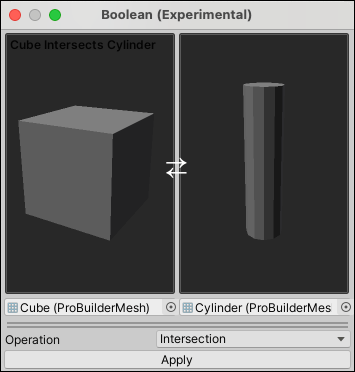

# Boolean operations

> **Note:** Boolean operations are an experimental feature. To use them, you must [enable experimental features](preferences.md#experimental).

To create a new ProBuilder mesh for the interactions of two existing ProBuilder meshes, use the Boolean (CSG) Tool.

To create a new mesh from two existing meshes:

1. Create two ProBuilder meshes that overlap in space.
1. [Enable experimental features](preferences.md#experimental).
1. In the main menu, go to **Tools** > **ProBuilder** > **Experimental** > **Boolean (CSG) Tool**. The **Boolean (Experimental)** window opens.
1. Select the source meshes by either:
    * Dragging from the **Hierarchy** window to **Drag GameObject here**.
    * Click **Select** (&#8857;) to open the **Select Pro Builder Mesh** window.
1. In **Operations**, select an operation type**:
    * **Intersection**: The new mesh is formed only from the overlapping area of the two source meshes.
    * **Union**: The new mesh is identical to the original meshes.
    * **Subtraction**: The new mesh is nearly identical to the original meshes, but is missing the area where the two meshes overlap.
1. Click **Apply**.
1. ProBuilder creates the new mesh based on the selected operation type. 
1. The new mesh is in the same location as the source meshes; deactivate or delete the source meshes if you don't need them.

