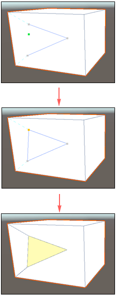
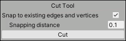

#  Cut tool

Use the Cut tool to easily subdivide mesh faces with precision. To cut out a shape on a mesh, you activate the Cut tool which lets you define the cutout shape with points. The cutout shape becomes a new face on the mesh.

To create a new face on an existing mesh face:

1. Open the ProBuilder window (in Unity's top menu: **Tools** > **ProBuilder window**).

	The [Edit Mode toolbar](overview-ui.md#edit-mode-toolbar) and the [ProBuilder toolbar](toolbar.md) appear. 

1. Switch to one of the element [editing modes](modes.md).

2. In the ProBuilder toolbar, click **Cut**. The **Cut Tool** panel appears at the bottom of the Scene view. If the ProBuilder toolbar is using [Text mode](customizing.md#text-vs-icon-mode), the button text background becomes red.

  **Note**: 

3. To control how close to any nearby edges you can place, use the options on the [Cut Tool panel](#cut-tool_panel).

5. Click on the mesh face where you want the vertices for the new face to be. ProBuilder creates the cutout shape based on the edges you draw with these points. For example, you can specify three points on the mesh to define a triangular shape and the fourth to close it:

  

  **Tip**: ProBuilder displays red edges as a visual warning if your points make an invalid edge or face. When this happens, undo adding each point until all the edges become blue again.

  As soon as you return to the first point and click it again (such as the fourth point in the triangle example), the cut is complete and you can either exit the tool or start another cut. 

6. To start another cut, click the **Cut** button. The new face appears selected in the Scene view and the **Cut Tool** panel now displays a **Start** button.

  **Note**: If you click the **Cut** button and nothing happens, it is probably because the points you defined do not create a valid edge or face. For example, if the tool detected only one point, that does not make a valid edge. You can define more points or exit the Cut tool to cancel the operation.

7. If you want to cut out another face on the same mesh, click the **Start** button.

8. To exit the Cut tool, select the Esc key or click **Cut Tool** on the ProBuilder toolbar.

	**Tip**: When you create a new face, the Cut tool creates extra edges in order to strengthen the geometry. Avoid merging the surrounding faces to remove the extra edges, because this could result in degenerated faces and broken geometry. 

	

## Cut Tool panel

When ProBuilder enters Cut mode, the following panel appears at the bottom of the Scene view:

 

Enable the **Snap to existing edges and vertices** option to snap the points you draw on the target face to any nearby edges and vertices. This makes it easier to place points on the edges or vertices of the face.

When snapping is enabled, the **Snapping distance** defines what happens as you approach a face border. By default, if you click within 0.1 units of an edge or vertex, the Cut tool adds your point on that border instead of adding a floating point directly on the face.

When you activate the Cut tool, the **Cut Tool** panel displays a **Cut** button. As soon as you complete the cut successfully, the **Start** button appears because the Cut tool is modal and you have the choice to either define another cutout or explicitly exit the tool:

* When you are ready to define points for a new cutout, click the **Start** button and draw more points on the mesh.
* When you want to exit the tool, click an action on the ProBuilder toolbar or select Esc.
