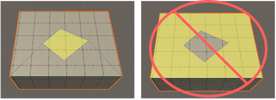

# The Cut tool

To create more complex shapes, you can subdivide a mesh's face with the Cut tool. The new face you create can be any shape; define the shape by placing points on the mesh. You can then move the new face as you would any other face.

You can use the Cut tool on any face, regardless of whether you created the mesh with the [New Shape](shape-tool.md) tool, the [New PolyShape](polyshape.md) tool, or by [probuilderizing](Object_ProBuilderize.md) a standard Unity mesh.

## Create a new face

To create a new face on an existing mesh face:

1. Select a shape. 
1. In the **Tools** overlay, set the active context to ProBuilder. The **Cut** tool is now available in the **Tools** overlay and the **Cut Settings** panel opens. For more information about the panel, refer to [Cut Settings panel](#cut-tool_panel).
1. To start drawing the outline of the new face, click on the mesh face you want to cut. If your points create an invalid edge or face, ProBuilder displays red edges. When this happens, undo adding each point until all the edges become blue again.
1. To complete the new face, return to the first point and click it, or click the **Complete** button in the **Cut Settings** panel. If nothing happens when you try to complete your shape, it's probably because the points you defined don't create a valid edge or face. Add more points, or undo adding the current points, until the shape is valid.

> **Tip**: When you create a new face, the Cut tool creates extra edges to strengthen the geometry. Avoid merging the surrounding faces to remove the extra edges, because this can break the geometry of the new face.

To exit the Cut tool, you can:

* Press **Esc**.
* Select **Cut Tool** in the **Tools** overlay again.

## Cut Settings panel

The Cut Settings panel offers the following options:

| **Option** | **Description** |
| --- | --- |
| **Snap to existing edges and vertices** | Snap the points you draw on the target face to any nearby edges and vertices. This makes it easier to place points on the edges or vertices of the face. |
| **Snapping distance** | Define how close a point needs to be to a vertex to snap onto that vertex instead of remaining on the face. |
| **Complete** | Click to complete the new face by connecting the first and last point you drew. If the points you defined don't create a valid edge or face, ProBuilder displays red edges. When this happens, undo adding each point until all the edges become blue again. |