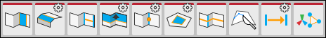

# Edge actions

This section of the ProBuilder toolbar provides access to ProBuilder editing actions that you can use in the [Edge edit mode](modes.md).

> **Note:** Some actions also have extra options or custom settings available. These action buttons have a special indicator in the top right corner. The documentation for each action includes information about these options.

##  Bridge Edges

Use the **Bridge Edges** action to create a new face between two selected edges. 

For more information, see the [Bridge Edges](Edge_Bridge.md) action documentation.

##  Bevel

Use the **Bevel** action to split the selected edge(s) into two edges, with a new face between.

For more information, see the [Bevel](Edge_Bevel.md) action documentation.

##  Connect Edges

Use the **Connect Edges** action to insert a new edge that connects the centers of each existing selected edge.

For more information, see the [Connect Edges](Edge_Connect.md) action documentation.

##  Extrude Edges

Use the **Extrude Edges** action to push a new edge out from each selected edge.

For more information, see the [Extrude Edges](Edge_Extrude.md) action documentation.

##  Subdivide Edges

Use the **Subdivide Edges** action to divide the selected edge(s) into multiple edges. 

For more information, see the [Subdivide Edges](Edge_Subdivide.md) action documentation.

##  Fill Hole

Use the **Fill Hole** action to create a new face that fills any holes that touch the selected edges.

For more information, see the [Fill Hole](Edge_FillHole.md) action documentation.

##  Insert Edge Loop

Use the **Insert Edge Loop** action to add a new edge loop from the selected edge(s). 

For more information, see the [Insert Edge Loop](Edge_InsertLoop.md) action documentation.

##  Cut Tool

Use the **Cut** tool to create a new face on an existing Mesh.

For more information, see the [Cut tool](cut-tool.md) documentation.

##  Offset Edges

Use the **Offset Elements** action in the Edge edit mode to move the selected edge(s) according to the settings. 

For more information, see the [Offset Elements](Offset_Elements.md) action documentation.

##  Set Pivot

Use the **Set Pivot** action to move the pivot point of this Mesh to the average center of the selected edges.

For more information, see the [Set Pivot](Edge_SetPivot.md) action documentation.

