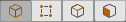

# The Edit Mode toolbar

Use the Edit Mode toolbar to switch between the four [ProBuilder Edit modes](modes.md):

*  **Object** mode: the standard Unity mode for [selecting and manipulating GameObjects](object-actions.md).
*  **Vertex** mode: the element mode for [selecting and manipulating vertices](vertex.md) (points) on a ProBuilder Mesh.
*  **Edge** mode: the element mode for [selecting and manipulating edges](edge.md) (lines) on a ProBuilder Mesh.
*  **Face** mode: the element mode for [selecting and manipulating faces](face.md) (polygons) on a ProBuilder Mesh.

The Vertex, Edge, and Face modes are also known collectively as the **Element** modes.

> **Tip:** By default, the Edit mode toolbar appears in the top middle of the Scene view, but you can reposition it with the [Toolbar Location](preferences.md#toolbarloc) preference.

## Edit mode hotkeys

In addition to the Scene view toolbar, [hotkeys](hotkeys.md) (keyboard shortcuts) are also available:

- `Escape` switches to **Object** mode from any other mode.
- `G` toggles between the **Object** and **Element** modes. For example, if you are in **Vertex** mode, press `G` once to return to **Object** mode, and press it again to switch back to **Vertex** mode.
- `H` toggles between the **Element** modes (**Vertex**, **Edge**, and **Face**).

If you prefer to have dedicated keys for each mode, you can enable the [Unique Mode Shortcuts](hotkeys.md#unique_mode) preference.

