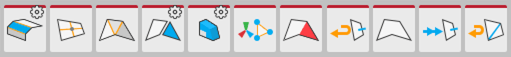

# Face actions

This section of the ProBuilder toolbar provides access to ProBuilder editing actions that you can use in the [Face edit mode](modes.md).

> ***Note:*** Some actions also have extra options or custom settings available. These action buttons have a special indicator in the top right corner. The documentation for each action includes information about these options.

##  Subdivide Faces

Use the **Subdivide Faces** action to add a vertex at the center of each edge and connect them in the center.

For more information, see the [Subdivide Faces](Face_Subdivide.md) action documentation.

##  Triangulate Faces

Use the **Triangulate Faces** action to reduce selected faces to their base triangles.

For more information, see the [Triangulate Faces](Face_Triangulate.md) action documentation.

##  Bevel

Use the **Bevel** action to [bevel](Edge_Bevel.md) every edge on the selected face(s).

For more information, see the [Bevel](Face_Bevel.md) action documentation.

##  Merge Faces

Use the **Merge Faces** action to merge selected faces into a single face, and remove any dividing edges.

For more information, see the [Merge Faces](Face_Merge.md) action documentation.

##  Conform Normals

Use the **Conform Normals** action to set all selected face normals to the same relative direction. 

For more information, see the [Conform Normals](Face_ConformNormals.md) action documentation.

##  Flip Face Edge

Use the **Flip Face Edge** (**Turn Edges**) action to swap the triangle orientation on the selected face(s) with four sides.

For more information, see the [Flip Face Edge](Face_FlipTri.md) action documentation.

##  Extrude Faces

Use the **Extrude Faces** action to pull out the currently selected face and attach sides to each edge.

For more information, see the [Extrude Faces](Face_Extrude.md) action documentation.

##  Duplicate Faces

Use the **Duplicate Faces** action to duplicate each selected face either as a new GameObject or in the same GameObject as a sub-Mesh.

For more information, see the [Duplicate Faces](Face_Duplicate.md) action documentation.

##  Detach Faces

Use the **Detach Faces** action to detach the selected face(s) from the rest of the Mesh.

For more information, see the [Detach Faces](Face_Detach.md) action documentation.

##  Delete Faces

Use the **Delete Faces** action to delete the selected face(s).

For more information, see the [Delete Faces](Face_Delete.md) action documentation.

##  Cut Tool

Use the **Cut** tool to create a new face on an existing Mesh.

For more information, see the [Cut tool](cut-tool.md) documentation.

##  Offset Faces

Use the **Offset Elements** action in the Face edit mode to move the selected face(s) according to the settings. 

For more information, see the [Offset Elements](Offset_Elements.md) action documentation.

##  Set Pivot

Use the **Set Pivot** action to move the pivot point of this Mesh to the average center of the selected faces.

For more information, see the [Set Pivot](Face_SetPivot.md) action documentation.

##  Flip Face Normals

Use the **Flip Face Normals** action to flip the normals only on the selected face(s).

For more information, see the [Flip Face Normals](Face_FlipNormals.md) action documentation.

