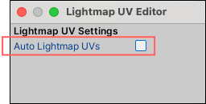

# Troubleshooting

This section covers the following issues:

* [Faces not rendering (or appearing black)](#norender)
* [Pink Shaders](#pink)
* [Spotty Textures on Lightmapped GameObjects](#spotty)
* [Missing FbxPrefab or assembly reference error](#fbx)


<a name="norender"></a>

## Faces not rendering (black)

If you are editing Mesh elements and suddenly notice that some of your faces have turned black, there are two common causes: * There is a problem with auto-lightmapping.
* You have two edges or two vertices in a single Mesh, and they are sharing the same space.


First, check the **Auto Lightmap UVs** setting on the [Lightmap UV Editor](lightmap-uv.md) window. Sometimes faces appear as black if auto-lightmapping hasn't rendered them yet. This usually happens if there are more rendering jobs than your resources can handle (particularly on older machines).

To access the **Auto Lightmap UVs** setting:

1. Open the [Lightmap UV Editor](lightmap-uv.md) window (**Tools** > **ProBuilder** > **Editors** > **Open Lightmap UV Editor**).

2. Disable the **Auto Lightmap UVs** option.

	

If you turn off the automatic lightmapping option and you still see faces that are not rendering, it may be that you have doubled vertices in your Mesh.

To fix elements that are sharing the same place:

1. Select the entire Mesh.
2. [Open the **Options** window](workflow-edit.md#edit) for the **Weld Vertices** action and make sure that the **Weld Distance** value is very low (for example, 0.01 or 0.0001). This ensures the action doesn't weld vertices that are close but not doubled.
3. Click the **Weld Vertices** button.

> **Tip:** You can enable the __Show Scene Info__ property in the [ProBuilder Preferences](preferences.md#info_overlay) window while debugging. This displays information about the selected Mesh, including the total number of vertices, edges, and faces, and how many are currently selected in the top left corner of the Scene view.


<a name="pink"></a>

## Pink Shaders

If you are using the new Scriptable Rendering Pipeline (SRP), make sure you import the corresponding URP or HDRP Shaders needed to display vertex colors and textures correctly. For more information, see [Support for scriptable render pipelines](installing.md).


<a name="spotty"></a>

## Spotty Textures on Lightmapped GameObjects


This happens when the GameObject does not have a UV2 channel.

To build the UV2 channel:

1. Select the affected GameObject(s).
2. Run the [Lightmap UVs](Object_LightmapUVs.md) action.


<a name="fbx"></a>

## Missing FbxPrefab or assembly reference error

You may see one or more of these errors if you have imported the **FBX Exporter** package, then later removed it:

```
<project-folder>/Addons/Fbx.cs(66,81): error CS0246: The type or namespace name `FbxNode' could not be found. Are you missing an assembly reference?

<project-folder>/Addons/Fbx.cs(11,19): error CS0234: The type or namespace name `Formats' does not exist in the namespace `UnityEditor'. Are you missing an assembly reference?

<project-folder>/Addons/Fbx.cs(8,7): error CS0246: The type or namespace name `Autodesk' could not be found. Are you missing an assembly reference?
```

To resolve these errors, you can follow either of these fixes:

* Re-import the **FBX Exporter** package.
* Open **PlayerSettings** (from the top menu: **Edit** > **Project Settings** > **Player**) and remove the **PROBUILDER_FBX_PLUGIN_ENABLED** flag from **Scripting Define Symbols**.
