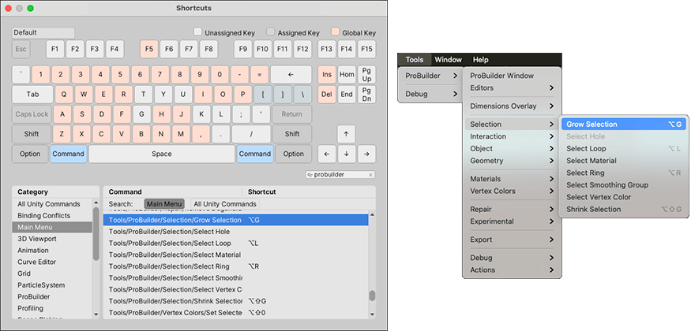

# ProBuilder keyboard shortcuts (hotkeys)

You can use keyboard shortcuts to access many of the actions that are available from the toolbar and the menu. The menu items that have associated shortcuts display the key combinations in the menu.

You can also change the default shortcuts on a few items in Unity's [Shortcut Manager](https://docs.unity3d.com/Manual/UnityHotkeys.html).

This page gives an overview of the default ProBuilder keyboard shortcuts. Where a command has **Ctrl/Cmd** as part of the keystroke, use the **Control** key on Windows and the **Command** key on macOS. Similarly, where a command has **Alt/Opt** as part of the keystroke, use the **Alt** key on Windows and either the **Alt** or **Option** key on macOS, depending on your keyboard.

> **Note:** There are a few exceptions where a shortcut uses the **Control** key for both Windows and macOS. These exceptions are clearly indicated on the action reference page and in the list below.

| **Key combination:**                                         | **Action:**                                                  |
| ------------------------------------------------------------ | ------------------------------------------------------------ |
| **Alt/Opt+Click(action button)**                             | Open options for any action on the toolbar.                  |
| **Alt/Opt+B**                                                | [Create a new face between two selected edges](Edge_Bridge.md). |
| **Alt/Opt+C**                                                | [Collapse the selected vertices](Vert_Collapse.md).          |
| **Alt/Opt+E**                                                | Create a new edge that connects either the [selected vertices](Vert_Connect.md) or the [centers of each selected edge](Edge_Connect.md), depending on what editing mode you are in. |
| **Alt/Opt+G**                                                | Increase ([grow](Selection_Grow.md)) the number of elements in the selection. |
| **Alt/Opt+L**                                                | Select either the [edge loop](Selection_Loop_Edge.md) or [face loop](Selection_Loop_Face.md), depending on which edit mode is active. |
| **Alt/Opt+N**                                                | [Flip Face Normals](Face_FlipNormals.md).                    |
| **Alt/Opt+R**                                                | Select either the [edge ring](Selection_Ring_Edge.md) or [face ring](Selection_Ring_Face.md), depending on which edit mode is active. |
| **Alt/Opt+S**                                                | Subdivide the selected [edges](Edge_Subdivide.md) or [faces](Face_Subdivide.md). |
| **Alt/Opt+U**                                                | [Insert edge loop](Edge_InsertLoop.md).                      |
| **Alt/Opt+V**                                                | [Weld selected vertices](Vert_Weld.md).                      |
| **Alt/Opt+X**                                                | [Split the selected vertex](Vert_Split.md) into individual vertices (one per adjacent face). |
| **Alt/Opt+#**                                                | [Apply a specific Material](material-tools.md#apply) to the selected object(s) or face(s). |
| **Alt/Opt+Shift+G**                                          | Reduce ([shrink](Selection_Shrink.md)) the number of elements in the selection. |
| **Alt/Opt+Shift+X**                                          | Toggle between [displaying hidden selected elements](preferences.md#sel-xray) in muted colors or not showing them at all. |
| **Alt/Opt+Shift+#**                                          | [Apply a vertex color](workflow-vertexcolors.md#apply) to the selected object(s) or element(s). |
| **Backspace**/**Delete**                                     | Delete the selected [faces](Face_Delete.md) or [Bezier shape points](bezier.md). |
| **Esc**                                                      | Enable the Object edit mode.                                 |
| **G**                                                        | Toggle between the Object and Element (geometry) edit modes. |
| **H**                                                        | Cycle through Vertex, Edge, and Face edit modes.             |
| **Ctrl+Click**                                               | [Align an adjacent face's UV coordinates](manual-uvs-actions.md#continue) to the current selection in the [UV Editor window](uv-editor.md). This action is often called "auto-stitching".  **Note**: You cannot remap this shortcut. It is only available while the [UV Editor window](uv-editor.md) is open, even though you can use it in the Scene view.  **Important:** Unlike many other shortcut combinations involving the **Ctrl** key in Windows and the **Cmd** key in macOS, this action works with only the **Ctrl** key for both platforms. |
| **Ctrl+Shift+Click**                                         | [Copy one face's UVs to the other faces](manual-uvs-actions.md#copy-uvs) in the current selection.  **Note**: You cannot remap this shortcut. It is only available while the [UV Editor window](uv-editor.md) is open, even though you can use it in the Scene view.  **Important:** Unlike many other shortcut combinations involving the **Ctrl** key in Windows and the **Cmd** key in macOS, this action works with only the **Ctrl** key for both platforms. |
| **Ctrl/Cmd+Shift+Click**                                     | [Select all faces in a path](SelectPath.md) between the current cursor position and the selected face(s).  **Note**: You cannot remap this shortcut, and it is only available in the Scene view when the [UV Editor window](uv-editor.md) is closed. |
| **Ctrl/Cmd+Drag** (while moving, rotating, or scaling) | Snap to UV increments in the [UV Editor window](uv-editor.md). |
| **Ctrl/Cmd+E**                                               | Extrude [edges](Edge_Extrude.md) and [faces](Face_Extrude.md) using the default options. |
| **Ctrl/Cmd+J**                                               | Move the pivot to the center of the currently selected elements:   - [Vertices](Vert_SetPivot.md)  - [Edges](Edge_SetPivot.md)  - [Faces](Face_SetPivot.md) |
| **Ctrl/Cmd+K**                                               | Create a [new Mesh cube](Cube.md).                           |
| **Ctrl/Cmd+Shift+K**                                         | Activate the [Shape tool](shape-tool.md).                    |
| **P**                                                        | Toggle between the three [orientation modes](HandleAlign.md) of the ProBuilder selection handle. |
| **Shift+Drag** (while moving, rotating, or scaling)          | Extrude [edges](Edge_Extrude.md) or [faces](Face_Extrude.md). |
| **Shift+Hover**                                              | Show tooltips when hovering over an action icon in the ProBuilder toolbar. |
| **0**                                                        | In the [UV Editor](uv-editor.md), resets the canvas by centering the Texture in the UV viewer (the workspace area of the UV Editor). |
