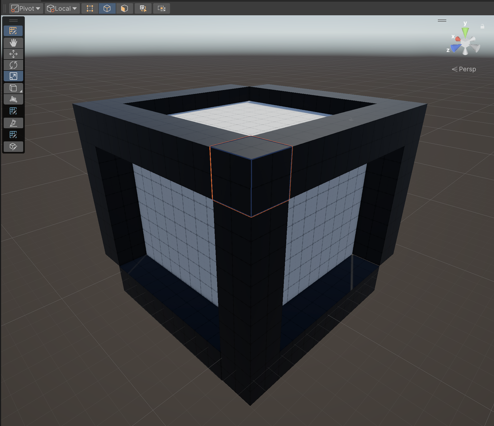

# About ProBuilder

You can build, edit, and texture custom geometry in Unity with the actions and tools available in the ProBuilder package. You can also use ProBuilder to help with in-scene level design, prototyping, collision Meshes, and play-testing. 

ProBuilder also comes with a [Scripting API](api.md), so that you can write C# scripts to make your own tools and customizations.

To add ProBuilder to Unity, refer to [Installing ProBuilder](installing.md). 

Some of the advanced features include:

* [UV editing and texture mapping](workflow-texture-mapping.md)
* [Applying Vertex Colors](workflow-vertexcolors.md)
* [Creating parametric shapes](workflow-create.md)

In addition, the ProBuilder package includes a [Model export feature](workflow-exporting.md), which you can use to tweak your levels in any 3D modeling software.

