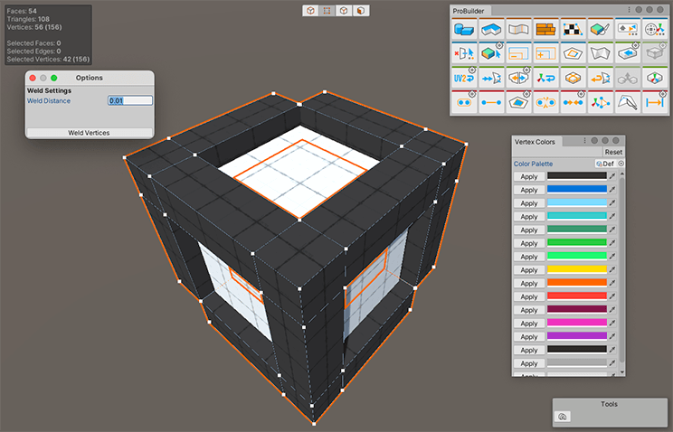

# Unity ProBuilder

Use ProBuilder to create, edit, and texture custom geometry in Unity. ProBuilder also includes a [Scripting API](api.md) so you can write C# scripts to make your own tools and customizations.

Use custom geometry for in-scene level design, prototyping, collision meshes, and play-testing. ProBuilder also includes a [model export feature](workflow-exporting.md) so you can edit your levels in any 3D modeling software.

| **Topic**                       | **Description**                  |
| :------------------------------ | :------------------------------- |
| **[Subpage A](link-to-page-A)** | Summary sentence from subpage A. |
| **[Subpage B](link-to-page-B)** | Summary sentence from subpage A. |
| **...**                         | ...                              |

## Additional resources

- [Install ProBuilder](installing.md)
- [Create meshes](workflow-create.md)

